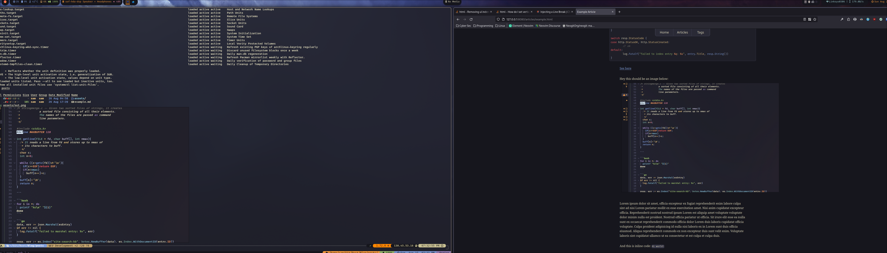

# Heading

Content

## Sub Heading

More content

```lua
local my_table = {
  string = "Nah",
  boolean = true,
  arr = {
    "nah",
    "yes",
    true,
    false,
    nil
  },
}
```

```rust
use std::collections::BTreeMap;

use comrak::plugins::syntect::SyntectAdapterBuilder;
use comrak::{markdown_to_html_with_plugins, ComrakOptions, ComrakPlugins};
use syntect::highlighting::ThemeSet;

#[derive(debug)]
fn main() {
    let theme = ThemeSet::load_from_reader(&mut std::io::Cursor::new(include_bytes!("../TwoDark.tmTheme"))).unwrap();
    let mut t = BTreeMap::new();
    t.insert(String::from("TwoDark"), theme);
    let mut theme_set= ThemeSet::new();
    theme_set.themes = t;
    let adapter = SyntectAdapterBuilder::new().theme("TwoDark").theme_set(theme_set).build();
    let options = ComrakOptions::default();
    let mut plugins = ComrakPlugins::default();

    // Hello World
    plugins.render.codefence_syntax_highlighter = Some(&adapter);


    let formatted = markdown_to_html_with_plugins(include_str!("../example.md"), &options, &plugins);

    println!("{}", formatted);
}

fn tester<'a>(in: i32) {
  println!("Hi {in}!");
}

impl MyExample<T> {
  fn fuck<T>() -> T {
    T
  }
}

struct MyMan {
  man: i32
}

enum fuck {
  RED: 1,
  BLUE: 2,
  GREEN: "Yep"
}
```

```js
var parseXML = function (data) {
  var xml, tmp;
  if (!data || typeof data !== "string") {
    return null;
  }
  try {
    if (window.DOMParser) {
      // Standard
      tmp = new DOMParser();
      xml = tmp.parseFromString(data, "text/xml");
    } else {
      // IE
      xml = new ActiveXObject("Microsoft.XMLDOM");
      xml.async = false;
      xml.loadXML(data);
    }
  } catch (e) {
    xml = undefined;
  }
  if (
    !xml ||
    !xml.documentElement ||
    xml.getElementsByTagName("parsererror").length
  ) {
    jQuery.error("Invalid XML: " + data);
  }
  return xml;
};

Sound.play = function() {}
Sound.prototype = { something; }
Sound.prototype.play = function() {}
Sound.prototype.play = myfunc
var parser = document.createElement('a');
parser.href = "http://example.com:3000/pathname/?search=test#hash";
parser.hostname; // => "example.com"
```

```python
import re

class Example:
  ...

class Eee(Example):
  ...

print("Yest")

def my_fn():
  ...

  my_fn(test, no)

class SublimeTasksBase(sublime_plugin.TextCommand):
    def run(self, edit):
        self.open_tasks_bullet = self.view.settings().get('open_tasks_bullet')
        self.done_tasks_bullet = self.view.settings().get('done_tasks_bullet')
        self.date_format = self.view.settings().get('date_format')
        if self.view.settings().get('done_tag'):
            self.done_tag = "@done"
        else:
            self.done_tag = ""
        self.runCommand(edit)

class NewCommand(SublimeTasksBase):
    thing = NewCommand()
    def runCommand(self, edit):
        for region in self.view.sel():
            line = self.view.line(region)
            line_contents = self.view.substr(line).rstrip()
            has_bullet = re.match('^(\s*)[' + re.escape(self.open_tasks_bullet) + re.escape(self.done_tasks_bullet) + ']', self.view.substr(line))
            current_scope = self.view.scope_name(self.view.sel()[0].b)
            if has_bullet:
                grps = has_bullet.groups()
                line_contents = self.view.substr(line) + '\n' + grps[0] + self.open_tasks_bullet + ' '
                self.view.replace(edit, line, line_contents)
```

```php
<?php

// base class with member properties and methods
class Vegetable {

   var $edible;
   var $color;

   function Vegetable($edible, $color="green")
   {
       $this->edible = $edible;
       $this->color = $color;
   }

   function is_edible()
   {
       return $this->edible;
   }

   function what_color()
   {
       return $this->color;
   }

} // end of class Vegetable

// extends the base class
class Spinach extends Vegetable {

   var $cooked = false;

   function Spinach()
   {
       $this->Vegetable(true, "green");
   }

   function cook_it()
   {
       $this->cooked = true;
   }

   function is_cooked()
   {
       return $this->cooked;
   }

} // end of class Spinach

?>
```

```ocaml


open Lexer_flow
module Ast = Spider_monkey_ast
open Ast
module Error = Parse_error
module SSet = Set.Make(String)
module SMap = Map.Make(String)

type lex_mode =
  | NORMAL_LEX
  | TYPE_LEX
  | JSX_TAG
  | JSX_CHILD

let mode_to_string = function
  | NORMAL_LEX -> "NORMAL"
  | TYPE_LEX -> "TYPE"
  | JSX_TAG -> "JSX TAG"
  | JSX_CHILD -> "JSX CHILD"

let lex lex_env = function
  | NORMAL_LEX -> token lex_env
  | TYPE_LEX -> type_token lex_env
  | JSX_TAG -> lex_jsx_tag lex_env
  | JSX_CHILD -> lex_jsx_child lex_env

type env = {
  errors          : (Loc.t * Error.t) list ref;
  comments        : Comment.t list ref;
  labels          : SSet.t;
  lb              : Lexing.lexbuf;
  lookahead       : lex_result ref;
  last            : (lex_env * lex_result) option ref;
  priority        : int;
  strict          : bool;
  in_export       : bool;
  in_loop         : bool;
  in_switch       : bool;
  in_function     : bool;
  no_in           : bool;
  no_call         : bool;
  no_let          : bool;
  allow_yield     : bool;
  (* Use this to indicate that the "()" as in "() => 123" is not allowed in
   * this expression *)
  error_callback  : (env -> Error.t -> unit) option;
  lex_mode_stack  : lex_mode list ref;
  lex_env         : lex_env ref;
}
```

```css
body {
  font-family: arial;
}

h1,
p,
table {
  background-color: #ccc;
  border: 1px solid;
  color: #39f;
  text-align: center;
  width: 100%;
}

.addon-store .pagehead h1 {
  display: inline-block;
}
.addon-store .addon-summary:after {
  clear: both;
}

#addon-store .pagehead .electrocat-small {
  bottom: -7px;
  position: absolute;
  right: 0;
}

.addon-store .addons-nav a.selected {
  border-bottom-color: #d26911;
  color: #333;
  font-weight: bold;
  padding: 0 0 14px;
}

.addon-store .addon-icon {
  background: #fff;
  border: 1px solid #ddd;
  box-shadow: 0 1px 2px rgba(0, 0, 0, 0.15);
  float: left;
  height: 80px;
  margin-right: 14px;
  width: 80px;
}

.addon-store .developer-callout {
  background-color: #f1f1f1;
  background-image: -moz-linear-gradient(#fafafa, #f1f1f1);
  background-image: -webkit-linear-gradient(#fafafa, #f1f1f1);
  background-image: linear-gradient(#fafafa, #f1f1f1);
  background-repeat: repeat-x;
  border: 1px solid #ddd;
  border-bottom: 1px solid #ccc;
  border-radius: 3px;
  box-shadow:
    inset 0 1px 0 #fff,
    0 1px 5px #f1f1f1;
  margin-top: 40px;
  text-shadow: 0 1px 0 #fff;
}
```

```
No language here!
```

```c
/* stringmerge.c -- Given two sorted files of strings, it creates
 *            a sorted file consisting of all their elements.
 *            The names of the files are passed as command
 *            line parameters.
 */

#include <stdio.h>
#define MAXBUFFER 128

int getline(FILE * fd, char buff[], int nmax){
  /* It reads a line from fd and stores up to nmax of
   * its characters to buff.
   */
  char c;
  int n=0;

  while ((c=getc(fd))!='\n'){
    if(c==EOF)return EOF;
    if(n<nmax)
      buff[n++]=c;
  }
  buff[n]='\0';
  return n;
}

```

```bash
for i in *; do
  printf "%s\n" "${i}"
done
```

```go
data, err := json.Marshal(esEntry)
if err != nil {
	log.Fatalf("failed to marshal entry: %v", err)
}

resp, err := es.Index("site-search-kb", bytes.NewBuffer(data), es.Index.WithDocumentID(entry.ID))
if err != nil {
	log.Fatal(err)
}

switch resp.StatusCode {
case http.StatusOK, http.StatusCreated:
	// ok
default:
	log.Fatalf("failed to index entry %q: %s", entry.Title, resp.String())
}
```

[See here](./another.md)

Hey this should be an image below:


Lorem ipsum dolor sit amet, officia excepteur ex fugiat reprehenderit enim labore culpa sint ad nisi Lorem pariatur mollit ex esse exercitation amet. Nisi anim cupidatat excepteur officia. Reprehenderit nostrud nostrud ipsum Lorem est aliquip amet voluptate voluptate dolor minim nulla est proident. Nostrud officia pariatur ut officia. Sit irure elit esse ea nulla sunt ex occaecat reprehenderit commodo officia dolor Lorem duis laboris cupidatat officia voluptate. Culpa proident adipisicing id nulla nisi laboris ex in Lorem sunt duis officia eiusmod. Aliqua reprehenderit commodo ex non excepteur duis sunt velit enim. Voluptate laboris sint cupidatat ullamco ut ea consectetur et est culpa et culpa duis.

And this is inline code: `Hi world!`


> Lorem ipsum dolor sit amet, officia excepteur ex fugiat reprehenderit enim labore culpa sint ad nisi Lorem pariatur mollit ex esse exercitation amet. Nisi anim cupidatat excepteur officia. Reprehenderit nostrud nostrud ipsum Lorem est aliquip amet voluptate voluptate dolor minim nulla est proident. Nostrud officia pariatur ut officia. Sit irure elit esse ea nulla sunt ex occaecat reprehenderit commodo officia dolor Lorem duis laboris cupidatat officia voluptate. Culpa proident adipisicing id nulla nisi laboris ex in Lorem sunt duis officia eiusmod. Aliqua reprehenderit commodo ex non excepteur duis sunt velit enim. Voluptate laboris sint cupidatat ullamco ut ea consectetur et est culpa et culpa duis. Lorem ipsum dolor sit amet, officia excepteur ex fugiat reprehenderit enim labore culpa sint ad nisi Lorem pariatur mollit ex esse exercitation amet. Nisi anim cupidatat excepteur officia. Reprehenderit nostrud nostrud ipsum Lorem est aliquip amet voluptate voluptate dolor minim nulla est proident. Nostrud officia pariatur ut officia. Sit irure elit esse ea nulla sunt ex occaecat reprehenderit commodo officia dolor Lorem duis laboris cupidatat officia voluptate. Culpa proident adipisicing id nulla nisi laboris ex in Lorem sunt duis officia eiusmod. Aliqua reprehenderit commodo ex non excepteur duis sunt velit enim. Voluptate laboris sint cupidatat ullamco ut ea consectetur et est culpa et culpa duis.
