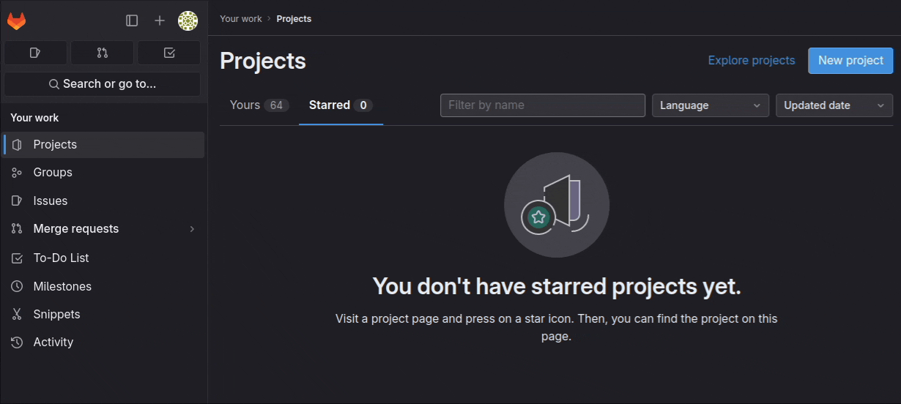
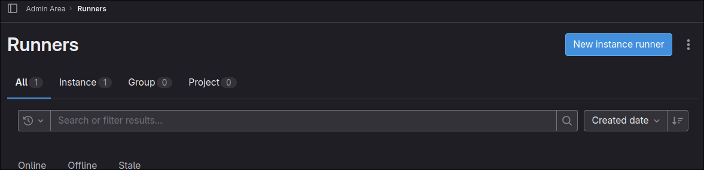

# What does this article cover?

- Why I chose NixOS
- Installing NixOS from the minimal installer.
- Using [Flakes](https://nixos.wiki/wiki/Flakes#) to configure the system
- An [Erase Your Darling's Setup on tmpfs](https://grahamc.com/blog/erase-your-darlings/) which wipes the system on
  every reboot. This seems crazy, but with NixOS this is _incredibly_ powerful.
- Self hosted [Gitlab](https://about.gitlab.com/install/) with a [Gitlab Runner](https://docs.gitlab.com/runner/)
- Secrets management with Agenix

This is _not_ a general NixOS tutorial, I'm assuming you have some level of familiarity with what a Nix Flake is and
what NixOS is. I strongly recommend against using this article as a how to for NixOS. This is not that. This is more my
musings and interesting tidbits I came upon whilst messing about with NixOS and a small bit of a guide to those who may
need Gitlab on NixOS.

# Why I Chose NixOS

If you don't care, you can skip to the next section [here](#installing-nixos). I do a minuscule amount of
ranting as to my reasoning, as you can probably guess.

My background in managing systems is via [Ansible](https://github.com/ansible/ansible) and that's how I'll be
approaching the why.

One setup that you can do with NixOS is an "[Erase Your Darling's](https://grahamc.com/blog/erase-your-darlings/)"
configuration. Using BTRFS, ZFS, or another file system with snapshot support, one can rollback the system on every
reboot to the last snapshot or mount the system on
[tmpfs](https://www.kernel.org/doc/html/latest/filesystems/tmpfs.html) and wipe it on reboot. By doing this we can have
NixOS declaratively set the system state such that anything outside of the config that hasn't been explicitly set to
persist on reboot gets wiped. This ensures the NixOS configuration is _the_ source of truth.

A criticism I have of Ansible is that it actively requires users to practice good check in control with it. Meaning they
have to remember or create a procedure to ensure all configuration ends up in Ansible. Not too hard if it's a one person
show, but becomes increasingly bothersome as more and more individuals need to contribute. In effect, this causes little
"hacks" accumulate on the system outside of version control by accident. Procedures to check-in everything into VCS only
solves this so much. My preference is to ensure the systems force us to take the correct action by default instead of
those actions being opt-in.

Even in the scenario in which you are _perfect_ about getting everything into VCS, Ansible still falls short. Ansible
doesn't necessarily define what is on a system and how it's configured, it defines how we'd _like_ a system to be
configured via a declarative set of (ideally) idempotent steps. These steps may fail, and, furthermore, there is nothing
at the system level enforcing the entering of these steps into Ansible. NixOS enforces this completely.

This all comes from a, perhaps extreme, ideology of mine that pretty much everyone will take the path of least
resistance when working on something for a longer period of time. They may commit to "Yeah, of course keep everything in
VCS" and some may be able to keep to that — most won't. Understanding this then, we must enforce below the human level
the desired outcomes of systems engineering we want. We want everything checked into VCS? Great, ensure everything _not_
checked in is wiped, all that work lost. Everyone will become comfy real fast with checking changes in under such a
system.

Another hill I am 99% willing to die on is ensuring that a server, or for that matter, any system should be able to
reproduced with minimal or no human interaction. My server went down in Chicago? No problem, I have that configuration
in VCS, I'll just put it on one in New York.

I believe these two elements lead to high velocity and more resilient infrastructure over time and are worth the upfront
investment to achieve as the dividends are huge.

Ideology and other ranting done. Let's get into it and thanks for reading that lore dump if you actually did 😉.

# Installing NixOS

A quick preface as to how I chose to setup my system. I'm rolling with an "[Erase Your Darling's Setup on
tmpfs](https://grahamc.com/blog/erase-your-darlings/)" such that my system is wiped on every boot with the goal of
keeping the system consistent with what I define in my Nix configs.

I wrote a install script to set all of this up for me, using BTRFS mostly for reasons of compression more than
snapshots. I'll have to reconsider BTRFS in the future. For now though, I'm using it.

As part of this install I do one thing that I've noticed most NixOS configurations are not doing, that being taking full
advantage of setting disk labels. Many configurations I've referenced run `nixos-generate-config` and call it a day
after checking that into version control. That works fine, but I far prefer being able to define my `filesystem.nix`
ahead of time. As such, disk labels.

For instance,
[Luna](https://gitlab.orion-technologies.io/philler/nixos/-/blob/Development/hosts/luna/os/filesystem.nix?ref_type=heads),
my home server, has its file system set ahead of time like so:

```nix
{ config, lib, pkgs, modulesPath, ... }:
{
  fileSystems = {
    "/" = {
      device = "none";
      fsType = "tmpfs";
      options = [ "defaults" "noatime" "mode=755" ];
    };

    "/boot" = {
      device = "/dev/disk/by-label/NixOS-Boot";
      fsType = "vfat";
      options = [ "defaults" "noatime" ];
      depends = [ "/" ];
    };

    "/nix" = {
      device = "/dev/disk/by-label/NixOS-Primary";
      fsType = "btrfs";
      options = [ "subvol=@nix" "compress=zstd" "noatime" ];
    };
  };

  zramSwap.enable = true;
}
```

Those disk labels, `NixOS-Boot` and `NixOS-Primary`, are set by my install script. Since I use the same script to
install NixOS everywhere I know ahead of time what labels to target. Magic.

Then I install NixOS after having defined a configuration with my [install script](https://gitlab.orion-technologies.io/philler/nixos/-/blob/Development/install.bash?ref_type=heads).

So a typical setup would look something like this:

1. Define the system ahead of time in my [`hosts/` directory](https://gitlab.orion-technologies.io/philler/nixos/-/tree/Development/hosts?ref_type=heads)
2. Install NixOS onto a flash drive (or into [Ventory](https://www.ventoy.net/en/index.html))
3. Start up the system using that minimal boot drive
4. Git clone my [NixOS configuration](https://gitlab.orion-technologies.io/philler/nixos.git), `git clone https://gitlab.orion-technologies.io/philler/nixos.git && cd nixos`
5. Identify the disk I'm going to install to via `lsblk`
6. Run my install script: `bash install.bash -d <DISK_HERE> -H <NEW-HOST>` (optionally passing `-e` to enable encryption)
7. Wait for it to be done. Potentially cry when something goes wrong with the install.
8. Reboot
   

# So where does Erase Your Darling's come in?

Right. So, the install script does a fair bit of heavy lifting, you may have noticed up in the `filesystem.nix` I pasted
up there that I had the root path, `/`, as an `fsType` of `tmpfs`. This is my erasure method. I then use
[Impermanence](https://github.com/nix-community/impermanence) to declare which directories shouldn't be nuked on reboot.
Those get saved into `/nix/persist/` and then symlinked back out on every reboot. I declare my default Impermanence
setup like so:

```nix
environment.persistence = {
  "/nix/persist" = {
    hideMounts = true;
    directories = [
      "/var/lib"
      "/var/log"
      "/etc/nixos"
      "/opt"
      "/persist"
    ];
    files = [
      "/etc/machine-id"
      "/etc/nix/id_rsa"
    ];
  };
};
```

So now, with that defined in my flakes, I get all of those defined directories and files persisted on reboot by default.
For each host I can then further define more directories to persist in the host-specific config.

Not too much to it, but quite powerful.

# Gitlab, Dollar Tree Github

I'm sure this heading won't be incendiary or anything.

At the time of writing, I self-host [Gitlab](https://about.gitlab.com/) to store all of my code and run CI/CD
operations. Originally I handled this all in Ansible and a bit of spit shine on [Debian](https://www.debian.org/).

Now NixOS is *really* cool, it provides a [built-in Gitlab service](https://search.nixos.org/options?channel=23.05&from=0&size=50&sort=relevance&type=packages&query=services.gitlab)! Which I don't use... yeah. The Gitlab service NixOS provides is a touch out of date and because Gitlab is the worst platform on the face of the planet of Earth when it comes to administration you can't restore a backup on even slightly different versions of Gitlab. So the built-in module is right out 😦.

I'm not screwed, there's another solution. Gitlab provides a [docker
image](https://docs.gitlab.com/ee/install/docker.html). That's what I ultimately went with.

I have a `docker` directory nestled within Luna's config with a `default.nix` file that looks like so:
```nix
{ pkgs, ... }:
{
  environment.systemPackages =  with pkgs; [
    docker_24
    docker-compose
  ];

  virtualisation = {
    oci-containers.backend = "docker";
    containers.enable = true;
    docker = {
      enable = true;
      autoPrune.enable = true;
      package = pkgs.docker_24;
    };
  };
  imports = [
    ./gitlab.nix
  ];
}
```

I don't *really* need docker-compose, but I'm saving myself trouble ahead of time and just shoving it on the system.
Increased attack surface? Yeah, a bit. Actually a likely issue? Nope, and it's damn useful.

The `gitlab.nix` file its importing looks like:

```nix
{ lib, config, specialArgs, ... }:
let
  gitlab_home = "/opt/gitlab";
  hostname = "gitlab.orion-technologies.io";
in
{
  virtualisation.oci-containers.containers.gitlab = {
    image = "gitlab/gitlab-ee:latest";
    autoStart = true;
    ports = [
      "127.0.0.1:8080:80"
      "2222:22"
    ];
    volumes = [
      "${gitlab_home}/config:/etc/gitlab"
      "${gitlab_home}/logs:/var/log/gitlab"
      "${gitlab_home}/data:/var/opt/gitlab"
    ];
    extraOptions = [
      "--shm-size=256m"
      "--hostname=${hostname}"
    ];
  };

  networking.firewall.allowedTCPPorts = [
    2222
  ];

  age.secrets.gitlab-runner-reg-config.file = specialArgs.secrets + "/gitlab-runner-reg-config.age";
  services.gitlab-runner = {
    enable = true;
    services = {
      default = with lib; {
        registrationConfigFile = config.age.secrets.gitlab-runner-reg-config.path;
        dockerImage = "alpine";
        tagList = [
          "alpine"
          "default"
        ];
      };
    };
  };

  services.nginx.virtualHosts."${hostname}" = {
    locations."/".proxyPass = "http://127.0.0.1:8080";
    forceSSL = true;
    enableACME = true;
  };
}
```

I'll break it down real quick for those poor basta— folks who end up deciding to put Gitlab on NixOS and have the same
issues as me.

---

Part uno, the actual Gitlab instance on Docker.
```nix
virtualisation.oci-containers.containers.gitlab = {
  image = "gitlab/gitlab-ee:latest";
  autoStart = true;
  ports = [
    "127.0.0.1:8080:80"
    "2222:22"
  ];
  volumes = [
    "${gitlab_home}/config:/etc/gitlab"
    "${gitlab_home}/logs:/var/log/gitlab"
    "${gitlab_home}/data:/var/opt/gitlab"
  ];
  extraOptions = [
    "--shm-size=256m"
    "--hostname=${hostname}"
  ];
};
```

This is almost verbatim copied over from Gitlab's docs, the only thing of note here is the volume mount path. That
variable `gitlab_home` was defined earlier as `/opt`. I persist that directory between reboots, so we're good to store
stuff there.

Make sure you've allowed port `2222` on the firewall:
```nix
networking.firewall.allowedTCPPorts = [ 2222 ];
```

If you forget to do so, you won't be able to use SSH keys on some git operations.

---

Part dos, the reverse proxy.

I like SSL, I hope you do too. Instead of allowing Gitlab to manage its own proxy, I prefer having a single proxy on the
host that handles all of that for the various containers that may be running.

I have a primary `nginx.nix` service file that contains the following:

```nix
{ config, ... }:
{
  services.nginx = {
    enable = true;
    recommendedProxySettings = true;
    recommendedOptimisation = true;
    recommendedGzipSettings = true;
    recommendedTlsSettings = true;
  };
  security.acme = {
    acceptTerms = true;
    defaults.email = "price@orion-technologies.io";
  };
}
```

A bit of basic setup for all the services and ensuring [ACME](https://datatracker.ietf.org/doc/html/rfc8555) (by the
way the ACME RFC is actually insanely well written, give it a read if you have time to kill) plays nice.

And then all I have to define is the specifics for a given virtual host.

```nix
services.nginx.virtualHosts."${hostname}" = {
  locations."/".proxyPass = "http://127.0.0.1:8080";
  forceSSL = true;
  enableACME = true;
};
```

In the config above the `hostname` variable is my Gitlab A record: `gitlab.orion-technologies.io`.

That's the nix side of things, we have a bit more to do on the Gitlab side of things. Which I am sad to say took me more
than just a few minutes to figure out because I didn't reference the docs, **RTFM**. Gitlab-wise we need to set the
following in our `gitlab.rb`:

```ruby
external_url 'https://gitlab.orion-technologies.io'
nginx['listen_port'] = 80
nginx['listen_https'] = false
gitlab_rails['gitlab_shell_ssh_port'] = 2222
```

Of course replace the external URL with yours. We disable HTTPS in the Nginx config because we are managing that on the
host with our own reverse proxy. Bind it on to port 80 which we pass out to the host accessible at `8080` to the docker
container. The one setting that wasted the most time of mine was `gitlab_shell_ssh_port` by a mile. Why did it not work?
Maybe I had the port closed on the network firewall, the world may never know. Real quick though, make sure you set
`gitlab_shell_ssh_port` to the *external* port that you're opening on the host, not the internal.

---

Part tres, the Gitlab runner

```nix
services.gitlab-runner = {
  enable = true;
  services = {
    default = with lib; {
      registrationConfigFile = toString ./path/to/runner/config;
      dockerImage = "alpine";
      tagList = [
        "alpine"
        "default"
      ];
    };
  };
};
```

You may have noticed I slightly changed the assignment for the `registrationConfigFile`. We'll talk about secrets
management in a sec. For the general use, if you don't want to handle secrets in your NixOS configuration, just set that
path to something like `/opt/gitlab/gitlab-runner-config` and store the config there. You'll need to get a runner token
from the Admin area which is located in the middle of nowhere. If you forgot how to get to the *stuck in Utah Admin
panel button* I've gotchu. Go to your Gitlab instance' home page, on the top left there is "Search or go to...", click
that and then click "Admin Area" in the modal that pops up. They couldn't have hidden that better if they tried, I
swear.


From here head to "CI/CD" > "Runners" and in the top right you should see a nice shiny "New Instance Runner" button:

Now fill those details out for your runner and hit "Create Runner" at the bottom. Do not close the page, we're going to
need the `url` and `token` from it.

Now remember the `registrationConfigFile` option mentioned earlier? This is when that becomes relevant. Create a file at
the `registrationConfigFile` path on the NixOS system and place the following into it:
```
CI_SERVER_URL=<URL-HERE>
REGISTRATION_TOKEN=<TOKEN-HERE>
```

So for me it would look something like:
```
CI_SERVER_URL=https://gitlab.orion-technologies.io
REGISTRATION_TOKEN=wdjD-dwa23AsdahSAli-ALWO
```

At this point when we run `nixos-rebuild switch` everything should be fine and dandy.

This is really cool, but if we want to go a step further we can actually manage this file along with our NixOS
configuration by encrypting it. If that seems a bit too iffy feel free to stop now. If you think that sounds neat,
managing secrets in NixOS, then onwards into the light!

# Agenix, where's my damn Yubikey plugin support?!

There's many ways to manage secrets in Nix the main ones are [agenix](https://github.com/ryantm/agenix) and
[sops-nix](https://github.com/Mic92/sops-nix). I ultimately settled on Agenix over sops-nix because [Yubikey is close to
native support with Agenix](https://github.com/ryantm/agenix/pull/186) and I have a Yubikey. The header of this section
isn't that serious, and perhaps I'll get annoyed enough to shepherd something to the finish line.

Age is self described as "...a simple, modern and secure file encryption tool, format...". I treat it basically as PGP
if it was sane.

If you have a Yubikey I recommend storing a master encryption key using
[age-plugin-yubikey](https://github.com/str4d/age-plugin-yubikey) which massively improves storing age keys in the PIV
store

The way I use this is shove a single master key in my Yubikey, then generate an age key for each host. So Luna, for
instance, has its own age key stored in an encrypted external drive. When I go to install Luna I decrypt the key and
copy it over to the server to a path where Nix will look for it when I do a rebuild. I keep a master key on my Yubikey
so in the scenario in which my external drive explodes into a million shards I still have a way of accessing the
encrypted information and vice versa. The yubikey dies? I look at the external drive. Is it perfectly redundant? No. But
for my needs it's good enough. You can take this as far as you'd like.

First things first to actually using this then. Get agenix installed and ready to roll and I recommend also installing
[age](https://github.com/FiloSottile/age) or [rage](https://github.com/str4d/rage) the encryption tool agenix wraps.

Agenix prefers you to use SSH keys, I'm not doing that. I'm purely using age keys with SSH left untouched. Go ahead and
create your age key for your host `age-keygen -o host.key` and make sure you save it somewhere secure.

In the nix flake, at the top level, create a `secrets` directory and in it create a `secrets.nix` file.

The `secrets.nix` file is used purely by agenix to encrypt and modify secrets. Within it we'll define the recipients,
the public keys that can encrypt the secrets where the age private key we generated can decrypt them. Get the public key
from your generated age key and let's modify the `secrets.nix` file.

Here is my `secrets.nix` file:
```nix
let
  keys = rec {
    master = "age1yubikey1qfnj0k4mkzrn8ef5llwh2sv6hd7ckr0qml3n9hzdpz9c59ypvryhyst87k0";
    orion-tech = {
      luna = [
        "age1jgwqs04tphuuklx4g3gjdg42mchagn2gu7sftknerh8y8l9n7v7s27wqgu"
        master
      ];
    };
  };
in

{
  "gitlab-runner-reg-config.age".publicKeys = keys.orion-tech.luna;
}
```
Take note that I have a master key and then a machine specific key for Luna. In the body we define the file that will be
encrypted with the given public keys, in my config that would be `gitlab-runner-reg.config.age` which allows either the
master key to decrypt it or Luna's key to decrypt it.

Let's go ahead and create the Gitlab runner config:
```bash
agenix -e gitlab-runner-reg-config.age -i /path/to/your/age/key
```

This will open the editor defined in your `$EDITOR` with the decrypted contents of the `gitlab-runner-reg-config.age`
file.

Let's go ahead and fill that out and save it in this format from earlier:
```
CI_SERVER_URL=<URL-HERE>
REGISTRATION_TOKEN=<TOKEN-HERE>
```

Great! We have our secret. How do we access it in our flake?

Earlier we had a `services.gitlab-runner` which had a `registrationConfigFile` setting. Instead of using `toString
<PATH-HERE>` we'll now use our secret like so:
```nix
age.secrets.gitlab-runner-reg-config.file =  ../secrets/gitlab-runner-reg-config.age;
services.gitlab-runner = {
  enable = true;
  services = {
    default = with lib; {
      registrationConfigFile = config.age.secrets.gitlab-runner-reg-config.path;
      dockerImage = "alpine";
      tagList = [
        "alpine"
        "default"
      ];
    };
  };
};
```

Replace `../secrets/gitlab-runner-reg-config.age` with the path to your secret.

You're done, that's it. Pretty neat, huh?

If you  don't like storing your secrets in a public repository you can of course add the `secrets` directory in as a git
submodule from a private repository if you so desire. You can read up on git submodules if that caught your interest
[here](https://git-scm.com/book/en/v2/Git-Tools-Submodules).


# The End?

The end indeed. You should have Gitlab with a runner rocking now on your server and, if you followed the secrets
section, secrets managed in your config.

If you want to see my config in all of its hideousness, you can find it [here](https://gitlab.orion-technologies.io/philler/nixos);

If you found anything wrong or egregious feel free to file an issue on the [Github Mirror](https://github.com/treatybreaker/blog).
